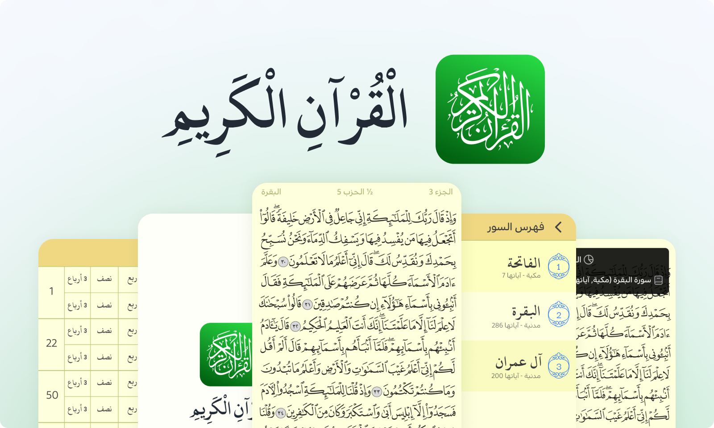

# The Holy Quran App (القرآن الكريم)
Application of the Holy Quran book of Muslims, developed using Flutter & Dart.




## بالعربية / Arabic

القران الكريم كاملاً دون اتصال بالانترنت وهو مطابق تماماً للمصحف الورقي

## 🎯 المميزات

✅ لا يحتاج اتصال بالانترنت

✅ وضع علامة و الانتقال اليها بسهولة

✅ توفر صفحة لفهرس السور و فهرس للاجزاء, 
الاحزاب, الارباع و الصفحات.

✅ الوضع الليلي

✅ حفظ اخر صفحة و الانتقال اليها عند فتح التطبيق

🔜 البحث عن آية (غير متوفر بعد)


## 🎯 Main Features

✅ Works offline

✅ Bookmark a page to easily go back to it

✅ Easily navigate with Surah's index page & Juz index page

✅ Dark mode

✅ Continue on the page you left off

🔜 Search for Ayah (comming soon)

## 📁 Download for Android
CLICK HERE to download.

## ⚙ Installation steps

You can copy anything from the code source.

If you want to get the full project:

```
git clone https://github.com/aymendn/the-holy-quran-app-flutter.git
cd the-holy-quran-app-flutter
flutter packages get
flutter run
```

## 🎨 Figma Project

There is also a free Figma project for this app.

You can check it out from here: [link]

## 🔨 Used packages

provider, carousel_slider, flutter_svg, shared_preferencesm flutter_native_splash, flutter_launcher_icons.

## 🧑 Author

__Aymen Dennoub__

If you liked the repo then kindly support it by giving it a star ⭐!

## 🤝 Contribution

- [fork my repository](https://github.com/user/repository/fork)

- [create issue](https://github.com/user/repository/issues/new)


